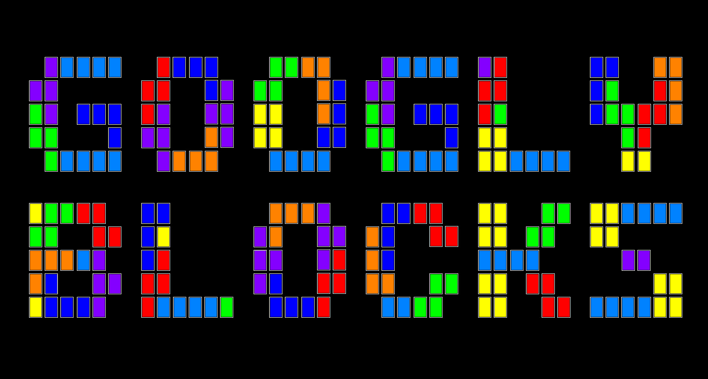

# Googly Blocks
A Tetris-like block puzzle game written in Rust.


## Usage
In order to run the game, compile and run the game witih
```
cargo run --release
```

## Controls
Here is the control scheme for the game.
```
Enter -- Start a new game from the start screen.
Arrow Down -- Move a piece down the playing field.
Arrow Right -- Move a piece to the right in the playing field.
Arrow Left -- Move a piece to the left in the playing field.
Arrow Up -- Rotate a piece.
Escape -- Quit the game.
```
